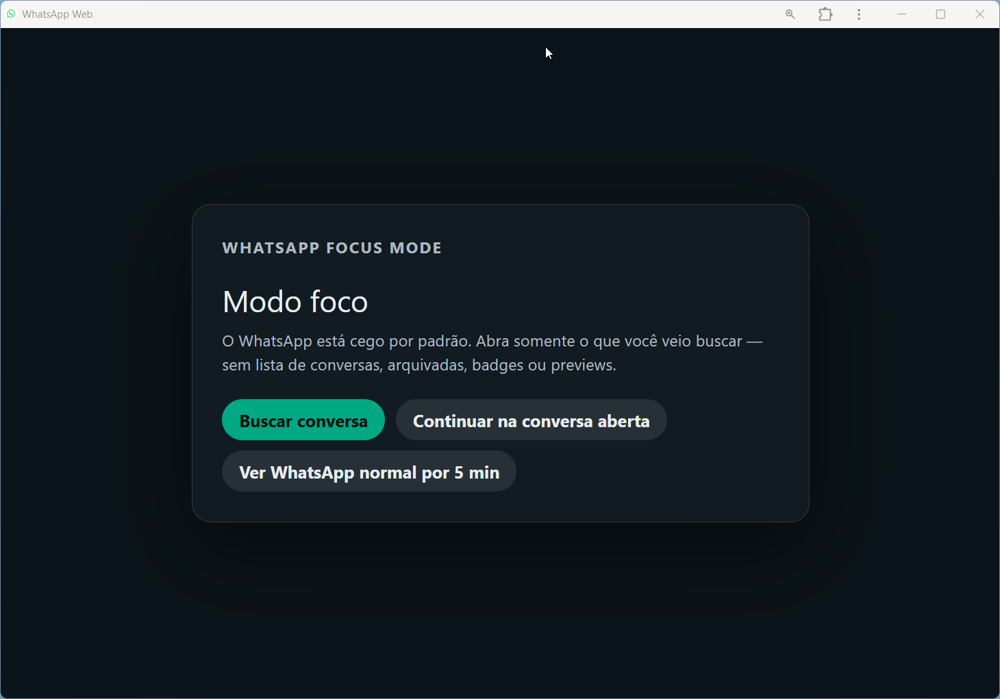

# WhatsApp Focus Mode

Protótipo local de extensão Chrome para abrir o WhatsApp Web em modo cego.

> **Status:** protótipo/MVP pessoal. Este projeto ainda não deve ser tratado como extensão pronta para distribuição pública.
>
> Projeto independente, não afiliado, associado, autorizado ou endossado por WhatsApp, Meta ou suas empresas relacionadas.

## Privacidade e segurança

- A extensão roda localmente no navegador e não possui backend.
- O código atual não envia mensagens, contatos ou dados de uso para servidores externos.
- Por ser uma extensão que roda em `web.whatsapp.com`, ela tem acesso técnico ao DOM visível do WhatsApp Web. Isso inclui elementos da interface, nomes de conversas e conteúdo exibido na tela.
- Esse acesso é necessário para ocultar a lateral, limpar previews e controlar o modo foco, mas significa que qualquer pessoa instalando a extensão precisa confiar no código.
- O hot-refresh de desenvolvimento (`focus.css` e `dev-config.json` em `web_accessible_resources`) é uma conveniência de prototipagem. Antes de uma versão pública/distribuível, ele deve ser removido ou protegido por build/flag de desenvolvimento.

## Como documentar o MVP

- `README.md`: uso atual, instalação, teste e limitações práticas.
- `docs/product-log.md`: dores observadas, decisões de design, aprendizados e backlog para uma futura reconstrução.

## Objetivo do Protótipo 1

Reduzir captura atencional ao abrir `web.whatsapp.com`:

- esconde o painel lateral (`#side`) por padrão;
- mostra uma tela neutra de **Modo foco**;
- inclui uma primeira opção **Buscar conversa**, que abre a busca nativa com tentativa de reduzir previews/badges;
- durante a busca, oculta resultados até que pelo menos 3 letras sejam digitadas, reduzindo a exposição a conversas recentes;
- ao escolher uma conversa no modo busca, volta automaticamente para conversa focada com a lateral escondida;
- nesse estado pós-busca, mostra um botão contextual **Buscar** no topo da área lateral ocultada para buscar outra conversa sem voltar ao overlay;
- permite continuar apenas na conversa aberta, ocultando o overlay e mantendo a lateral escondida;
- oculta a ação **Continuar na conversa aberta** quando não detecta conversa aberta;
- durante o carregamento inicial do WhatsApp Web, mantém a tela cega e exibe estado de carregamento sem ações clicáveis;
- oferece uma válvula de escape: **Ver WhatsApp normal por 5 min**;
- adiciona botão vertical **Voltar ao modo foco** na barra lateral esquerda, para não cobrir conteúdo da conversa;
- adiciona botão **Lateral** para mostrar/ocultar a barra lateral no modo full/manual;
- adiciona atalhos `Alt+Shift+F` para voltar ao modo foco e `Alt+Shift+L` para mostrar/ocultar lateral;
- recarregar a página sempre volta ao modo foco, sem esperar os 5 minutos.

A busca limpa própria ainda não existe. O protótipo atual usa a busca nativa do WhatsApp em um estado intermediário de menor ruído.

## Como instalar localmente no Chrome

1. Abra `chrome://extensions`.
2. Ative **Developer mode** / **Modo do desenvolvedor**.
3. Clique em **Load unpacked** / **Carregar sem compactação**.
4. Selecione a pasta clonada deste projeto.
5. Abra ou recarregue `https://web.whatsapp.com`.

## Desenvolvimento sem recarregar a aba toda

A extensão tem um pequeno hot-refresh de desenvolvimento. Isso é **dev-only** e deve ser removido/gateado antes de qualquer distribuição pública.

Depois de uma recarga única da extensão e da aba, o `content.js` passa a buscar a cada 1 segundo:

- `focus.css`
- `dev-config.json`

Isso permite ajustar CSS, posição do botão e seletores de ocultação sem recarregar o WhatsApp Web.

Ainda precisa recarregar quando mudar:

- `manifest.json`;
- `content.js`;
- permissões;
- arquivos novos não declarados em `web_accessible_resources`.

Para ajustes de ruído visual, prefira editar `dev-config.json`.

## Como testar

1. Ao abrir WhatsApp Web, a tela deve mostrar apenas **Modo foco**.
2. O painel lateral de conversas não deve aparecer.
3. Clique em **Buscar conversa**.
4. A lateral deve aparecer para permitir a busca nativa, sem mostrar resultados antes de 3 letras.
5. Digite 3 letras; os resultados aparecem com menos previews/badges quando os seletores funcionarem.
6. Selecione uma conversa; a lateral deve sumir automaticamente depois da seleção.
7. Clique em **Voltar ao modo foco** para retornar à tela neutra.
8. Teste `Alt+Shift+F` para voltar ao modo foco e `Alt+Shift+L` para mostrar/ocultar a lateral no modo full/manual.
9. Clique em **Continuar na conversa aberta**.
10. A conversa, se houver uma aberta, fica visível; a lateral continua escondida.
11. Clique em **Ver WhatsApp normal por 5 min** para validar a válvula de escape.
12. Durante o modo normal, clique em **Voltar ao modo foco** para encerrar a liberação antes dos 5 minutos.
13. Recarregue a página e confirme que ela volta ao modo foco imediatamente.

## Limitações conhecidas

- O seletor principal da lateral é `#side`, que pode mudar se o WhatsApp alterar o DOM.
- A busca limpa própria ainda não existe; o estado “Buscar conversa” usa a busca nativa do WhatsApp com redução visual parcial.
- Se nenhuma conversa estiver aberta, o botão “Continuar na conversa aberta” pode deixar uma área vazia — isso é aceitável neste v0.
- O overlay usa `hidden`; há uma regra CSS explícita para impedir que o estilo `display: flex` sobrescreva o estado oculto.
